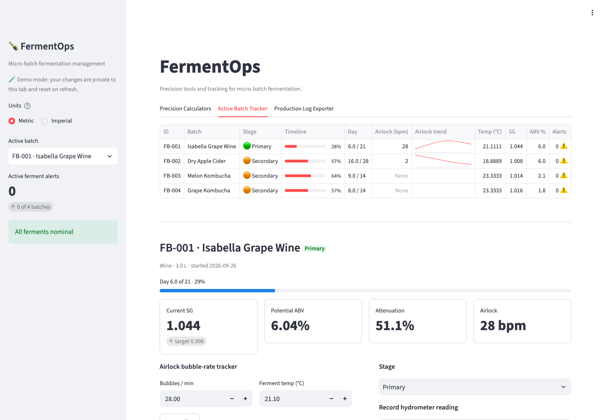
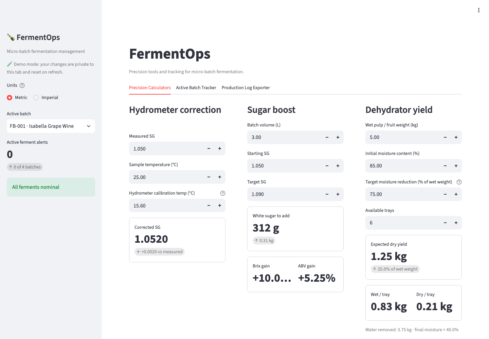
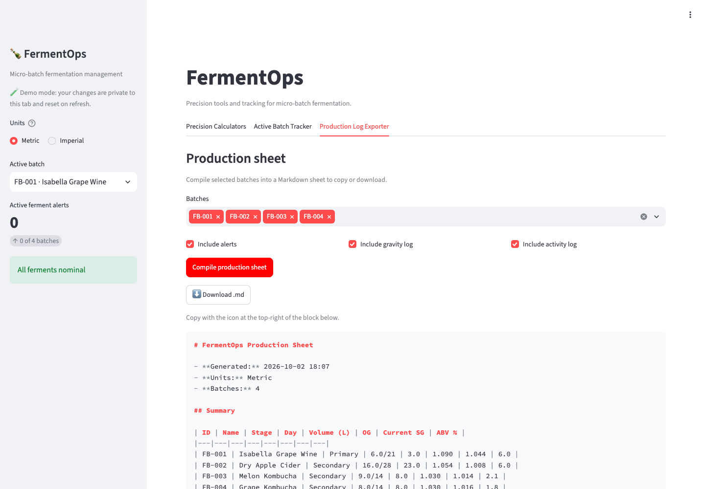
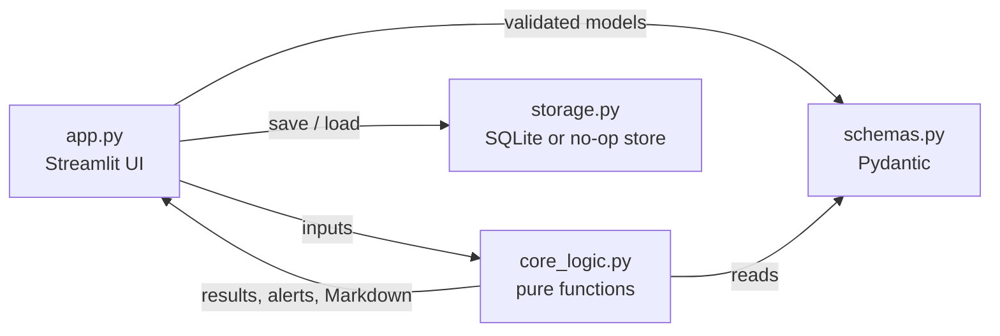

# 🍾 FermentOps

**Precision calculators, batch tracking and production-sheet export for micro-batch fermentation.**

[](https://github.com/python-matte/fermentops/actions/workflows/ci.yml)
[](https://github.com/python-matte/fermentops/actions/workflows/pages.yml)
[](LICENSE)


### ▶ [**Try the live demo**](https://python-matte.github.io/fermentops/)

No install and no account. The whole app runs **inside your browser** (Python compiled to WebAssembly), so nothing you type ever leaves your device. The first load takes 10–30 seconds while Python starts; later visits are cached.



## What it does

Home fermenters of wine, cider and kombucha keep redoing the same fiddly arithmetic (temperature-correcting a hydrometer reading, working out how much sugar to add, judging whether a ferment has stalled). FermentOps puts all of it in one place.

| Tab | What you get |
|---|---|
| **Precision Calculators** | Hydrometer temperature correction · sugar-boost amounts · ABV and attenuation · dehydrator wet-to-dry yield, with a Metric/Imperial toggle |
| **Active Batch Tracker** | Every ferment on one dashboard: stage, timeline, airlock bubble-rate trend, gravity, ABV. Log readings, record hydrometer checks, keep an activity log |
| **Production Log Exporter** | Compile any batches into a clean Markdown production sheet to copy or download |

The tracker also raises **alerts** for the things that actually go wrong: temperature outside the stage window, a silent airlock while gravity is still high (a possible stuck ferment), no reading in 24 hours, and batches running past their expected duration.

<details>
<summary>More screenshots</summary>





</details>

## Run it locally

Requires Python 3.11 or newer.

```bash
git clone https://github.com/python-matte/fermentops.git
cd fermentops
python3 -m venv .venv && source .venv/bin/activate
pip install -r requirements.txt
streamlit run app.py
```

Run locally, your batches are **saved** to a SQLite file at `data/fermentops.db`. That file is git-ignored, so your real data is never committed. Set `FERMENTOPS_DB=/path/to/file.db` to store it elsewhere.

| Mode | How | Where data lives |
|---|---|---|
| **Persistent** (default) | `streamlit run app.py` | SQLite file on your disk |
| **Demo** | `FERMENTOPS_DEMO=1 streamlit run app.py` | Nowhere. Each browser tab gets a private, freshly seeded sandbox that resets on refresh |
| **Browser** (the live site) | Automatic | Nowhere. Same as demo mode |

On first run the four demo batches are seeded once. Delete them from the tracker's *Manage batch* panel.

## How it works



The design goal is that **the part that has to be right is easy to prove right**:

- [`core_logic.py`](core_logic.py) holds every formula and alert rule as side-effect-free functions. They never read the clock (callers pass `now`) and never touch the disk, so each one is trivially testable. Bad input raises a specific `FermentValueError` instead of producing a plausible wrong number.
- [`schemas.py`](schemas.py) defines the data model with Pydantic, so invalid state (a gravity of 5.0, a target above the starting gravity) cannot be constructed.
- [`storage.py`](storage.py) hides persistence behind one small interface with two implementations, which is what lets the same code run on a laptop *and* in a browser tab.
- [`app.py`](app.py) is only the UI. It contains no formulas.

Full detail is in [docs/ARCHITECTURE.md](docs/ARCHITECTURE.md), and the maths, with worked examples and limitations, is in [docs/FORMULAS.md](docs/FORMULAS.md).

## Testing

```bash
pip install -r requirements-dev.txt
ruff check .
pytest
```

130+ tests cover:

- **The maths** — worked examples checked by hand, boundary values, and the published hydrometer polynomial.
- **Defensive validation** — every rejected input (a starting SG of exactly 1.000, FG above OG, moisture reduction above moisture content, zero trays, NaN and infinity).
- **Alert rules** — including the boundaries (inclusive temperature windows, the two-day grace period before a ferment can count as "stuck").
- **Persistence** — round trips, ordering, in-place updates, and the demo/browser stores.
- **The UI itself** — Streamlit's headless `AppTest` drives the real app: calculators, unit toggle, logging a reading, creating and deleting a batch, exporting a sheet.
- **The deploy** — a guard that fails if the app imports a module the web build doesn't ship.

CI runs lint and tests on Python 3.11 and 3.13 for every push and pull request, and the deploy workflow refuses to publish if either fails.

## Deployment

GitHub Pages serves only static files, and Streamlit normally needs a Python server. This project bridges that gap with [stlite](https://github.com/whitphx/stlite), a build of Streamlit that runs in the browser on WebAssembly (Pyodide). The deployed site runs the **same unmodified source files** as the local app; [`scripts/build_site.py`](scripts/build_site.py) copies them next to a small [host page](web/index.html), and a GitHub Actions workflow publishes the result. See [docs/DEPLOYMENT.md](docs/DEPLOYMENT.md) for how it works, how to reproduce it, and the trade-offs.

## Built with AI

This project is an example of using an AI coding assistant on a personal, real-world problem rather than a work task. [docs/BUILT_WITH_AI.md](docs/BUILT_WITH_AI.md) describes the working method: how the code is structured so AI-written work can be checked, and how the tests keep the result honest.

## Limitations

FermentOps is a hobbyist calculator, not laboratory software. The sugar and ABV formulas are standard approximations (see [docs/FORMULAS.md](docs/FORMULAS.md)); your hydrometer, your sanitation and your own judgement matter more than any number on screen. Nothing here is food-safety advice.

## License

[MIT](LICENSE)
