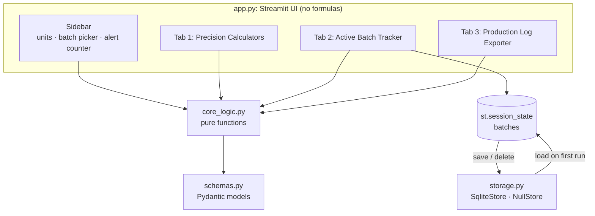
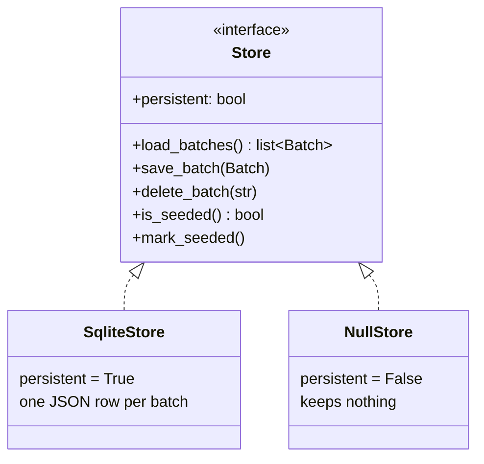
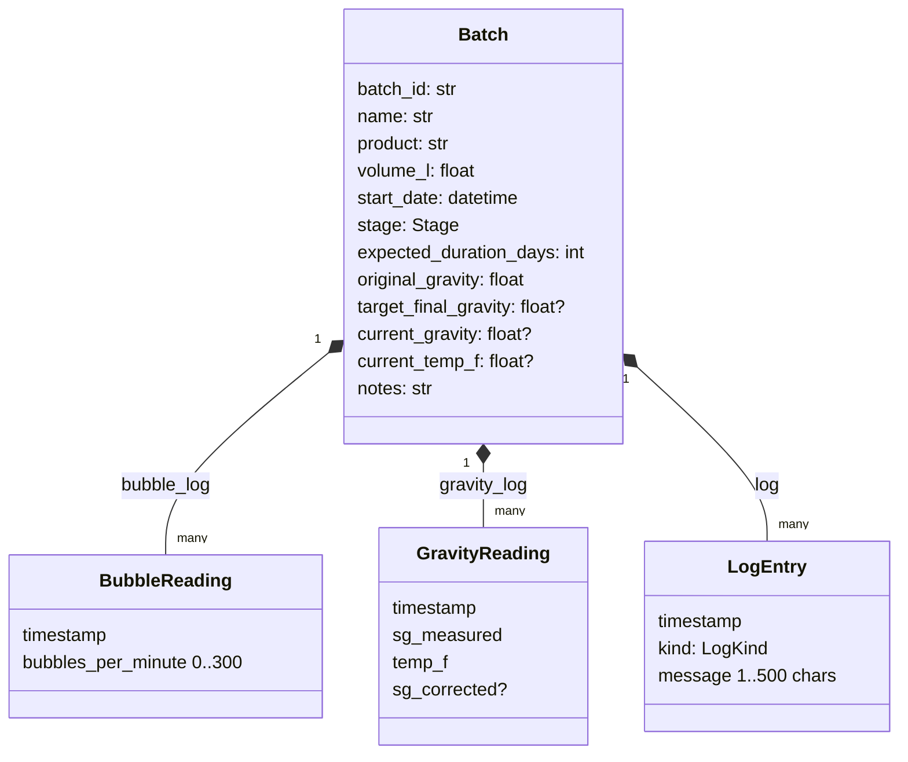

# Architecture

FermentOps is deliberately small: four Python modules, one responsibility each.

| Module | Responsibility | Depends on |
|---|---|---|
| [`app.py`](../app.py) | Layout, widgets, callbacks, seed data. Contains **no** formulas | all three below |
| [`core_logic.py`](../core_logic.py) | Formulas, unit conversion, alert rules, Markdown rendering | `schemas` |
| [`schemas.py`](../schemas.py) | Data model and its validation bounds | Pydantic only |
| [`storage.py`](../storage.py) | Persistence behind a two-implementation interface | `schemas` |

Dependencies point one way. `core_logic`, `schemas` and `storage` know nothing about Streamlit, so they can be tested without a UI and reused behind a different front end.

## Design decisions

### 1. A pure, clock-free core

Every function in `core_logic.py` is deterministic: no I/O, no globals, and no reading of the system clock. Anything time-dependent (progress, alerts, the sheet's "generated" stamp) takes `now` as an argument. That makes the trickiest logic, such as "a silent airlock after two days while gravity is above target", testable with a fixed date and no mocking.

### 2. Canonical units, converted at the edge

Everything stored or calculated is in litres, kilograms, grams, °F and SG. The unit toggle converts on the way into and out of widgets (`*_to_display` / `*_from_display`). There is exactly one place where a unit can be wrong, and the round trips are tested.

### 3. Make invalid state unrepresentable

`schemas.Batch` validates on construction **and on assignment** (`validate_assignment=True`), and cross-checks fields (target final gravity must be below original gravity). The UI constructs models inside `try/except ValidationError` and shows the message inline. Calculations raise `FermentValueError`, which the UI catches and renders in place of a result.

### 4. Storage as a swappable interface

`make_store()` picks the implementation:

| Condition | Store |
|---|---|
| `FERMENTOPS_DEMO=1` | `NullStore` |
| Running in the browser (`sys.platform == "emscripten"`) | `NullStore` |
| Otherwise | `SqliteStore` at `FERMENTOPS_DB` (default `data/fermentops.db`) |

Each batch is stored as a single JSON document (`Batch.model_dump_json()`), so adding a field to the model needs no schema migration; the model's defaults fill in older rows. `sqlite3` is imported lazily inside `SqliteStore`, because the browser runtime does not ship it and never needs it.

### 5. One code path for laptop and browser

Because storage is behind an interface and the core has no I/O, the exact same files run under CPython (local) and under Pyodide (the GitHub Pages site). See [DEPLOYMENT.md](DEPLOYMENT.md).

## Data model

`Stage` is one of Primary, Secondary, Cold Crash, Aging. `LogKind` is Note, Addition, Transfer or Tasting.

## UI state flow

Streamlit re-runs the whole script on every interaction, so state needs care:

- **Batches** live in `st.session_state["batches"]`, loaded once per session from the store (or seeded in demo mode).
- **Writes use callbacks** (`_cb_log_airlock`, `_cb_log_gravity`, `_cb_add_log`, `_cb_add_batch`, `_cb_delete_batch`, `_cb_stage`). A callback mutates the in-memory batch, then calls `_save()`. Callbacks run *before* the re-run, so the page that renders next already reflects the change.
- **Feedback** is queued with `_flash()` and shown on the next render, since a callback cannot draw to the page itself.
- **Widget keys** include the batch ID (and the unit system where the value is unit-dependent), so switching batch or units never leaves a stale value in a widget. Deleting a batch clears that batch's widget keys so a reused ID starts clean.

## Testing strategy

| Layer | File | Approach |
|---|---|---|
| Formulas, alerts, rendering | `tests/test_core_logic.py` | Hand-computed worked examples, boundaries, every rejection path |
| Models | `tests/test_schemas.py` | Bounds, cross-field rules, JSON round trip |
| Persistence | `tests/test_storage.py` | Temp-file SQLite, ordering, in-place update, store selection |
| UI | `tests/test_app.py` | Streamlit `AppTest` drives the real script headlessly |
| Deploy | `tests/test_build_site.py` | Fails if the web build omits a module the app imports |

## Extending it

- **A new sugar:** add it to `SUGAR_FACTORS` in `core_logic.py` and a test; expose it with a `selectbox` in `_panel_sugar`.
- **A new alert:** add a rule to `evaluate_alerts` and a test with a fixed `now`. It appears in the sidebar, tracker and exported sheet automatically.
- **A new batch field:** add it to `Batch` with a default (old rows still load), then to the form and the sheet renderer.
