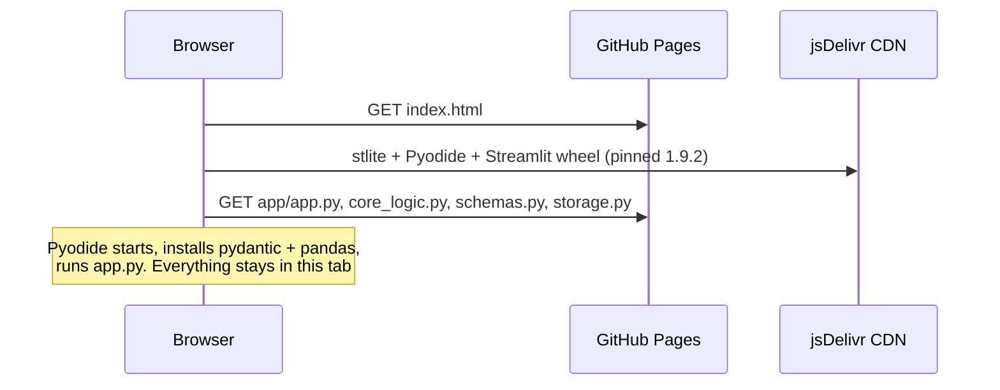

# Deployment

The live app is hosted on **GitHub Pages**, which serves only static files. FermentOps is a Streamlit app, and Streamlit normally needs a running Python server. This document explains how the gap is bridged, how to reproduce it, and what it costs.

## How it works

[stlite](https://github.com/whitphx/stlite) is a build of Streamlit that runs entirely in the browser: Python itself is compiled to WebAssembly via [Pyodide](https://pyodide.org), and Streamlit's server side runs inside a Web Worker. The page you visit is static; the "server" is a tab-local sandbox.



Consequences worth knowing:

- **Privacy:** nothing you type is sent anywhere. There is no backend to send it to.
- **State:** the app runs in demo mode (`NullStore`); every tab is a private sandbox that resets on refresh. This is automatic: `storage.make_store()` detects the browser runtime.
- **Same code:** the site serves the repository's own `.py` files, byte for byte. There is no separate "web version" to keep in sync.

## What gets published

[`scripts/build_site.py`](../scripts/build_site.py) assembles `_site/`:

```
_site/
├── index.html      # web/index.html with the module list filled in
├── .nojekyll       # serve files as-is
└── app/
    ├── app.py          # entrypoint
    ├── core_logic.py
    ├── schemas.py
    └── storage.py
```

[`web/index.html`](../web/index.html) loads stlite from a CDN at a **pinned exact version** and calls `mount()` with the entrypoint, the file URLs and the Python requirements. A test ([`tests/test_build_site.py`](../tests/test_build_site.py)) fails if the app imports a local module that the build does not ship, or if the browser requirements drift from `requirements.txt`.

## The workflow

[`.github/workflows/pages.yml`](../.github/workflows/pages.yml) runs on every push to `main`:

1. Install dependencies, then run `ruff` and `pytest`. **A failing test or lint error stops the deploy.**
2. Build `_site/`.
3. Upload it as a Pages artifact and deploy it.

[`.github/workflows/ci.yml`](../.github/workflows/ci.yml) runs lint and tests on Python 3.11 and 3.13 for every push and pull request.

### One-time repository setup

In the GitHub repository go to **Settings → Pages → Build and deployment → Source** and choose **GitHub Actions**. After that, every push to `main` redeploys. The site appears at `https://<user>.github.io/<repo>/`.

## Reproduce it locally

```bash
python scripts/build_site.py
python -m http.server -d _site 8000
# open http://localhost:8000 (allow 10–30 s for first start-up)
```

A page served over `file://` will not work; browsers block the module and fetch calls, so use the local server.

## Upgrading stlite

The version appears in `web/index.html` (twice) and is enforced to be a single pinned value by a test. To upgrade: change both occurrences, rebuild, load the site locally and click through all three tabs (the dataframe, charts and downloads exercise the most browser-specific code). Each stlite release bundles a specific Streamlit version; `requirements.txt` sets the minimum Streamlit for local installs.

## Trade-offs

| | Effect |
|---|---|
| **Cold start** | The first visit downloads Python, pandas and Streamlit (tens of MB) and takes 10–30 s. Later visits use the browser cache |
| **CDN dependency** | The page loads stlite from jsDelivr. If it is unreachable the app does not start. A pinned version means a changed upstream cannot silently change behaviour |
| **No persistence** | Data is lost on refresh by design. Run locally for a real, saved log |
| **Package availability** | Only packages that exist for Pyodide can be used. `sqlite3` is not bundled by default, so it is imported lazily and the browser never loads it |
| **Version skew** | stlite's bundled Streamlit can trail the newest release by a few versions |

## Alternatives considered

- **Streamlit Community Cloud**: runs real server-side Python and is the least work, but it is not GitHub Pages and cold-starts a container.
- **Rewriting the UI in JavaScript**: would give an instant-loading site, but forks the codebase and discards the tested Python logic.
- **Containers on a PaaS**: real server, real persistence, but an ongoing cost and more to operate for a demo.
